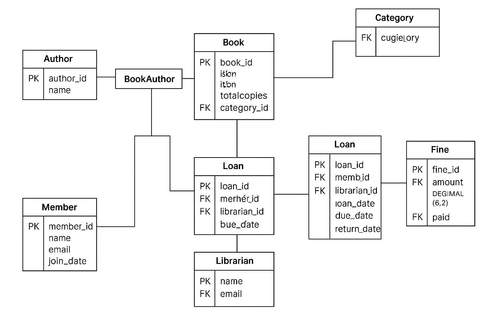

# 📚 Library Management System - Database Design

This project is Task 1 for the Database Management role in the **Brainwave Matrix Solutions Internship Program**.

## ✅ Task Objective

Design and implement a relational database schema to manage a Library Management System (LMS) that handles:

- Book records
- Authors
- Members
- Loans (Issued/Returned books)
- Categories
- Fines
- Librarians

---

## 🧱 Database Schema

### Tables:
- `Author`
- `Category`
- `Book`
- `BookAuthor` (Join table for many-to-many)
- `Member`
- `Librarian`
- `Loan`
- `Fine`

### ER Diagram:
 <!-- Replace with actual ERD image if available -->

---

## 🛠️ Tech Stack
- MySQL (or compatible RDBMS)
- GitHub for version control
- LinkedIn for publishing progress

---

## 📁 Files

- `library_db.sql` - SQL file to create the full database schema
- `ERD.png` - Visual ERD of the schema (optional but recommended)
- `library_inserts.sql` - Insertions into the tables

---

## 📌 Author

**Intern:** Kothapally Keerthana 
**GitHub:** kothapallykeerthana04
**LinkedIn:** www.linkedin.com/in/kothapally-keerthana0402

